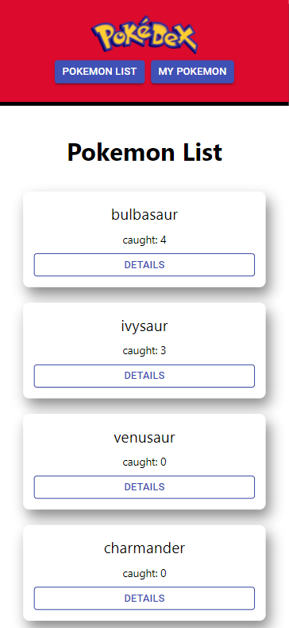
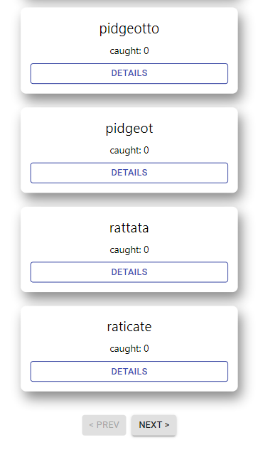
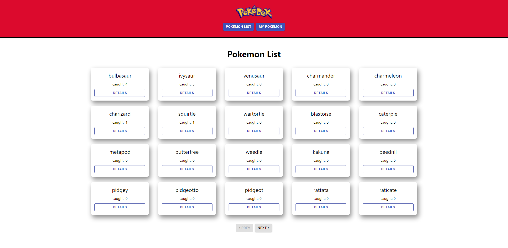
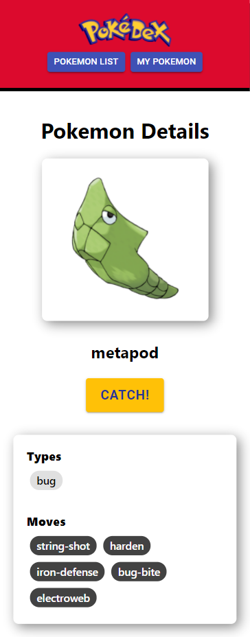
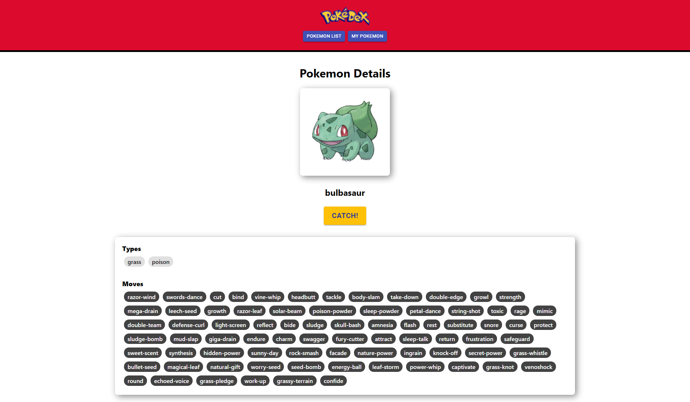
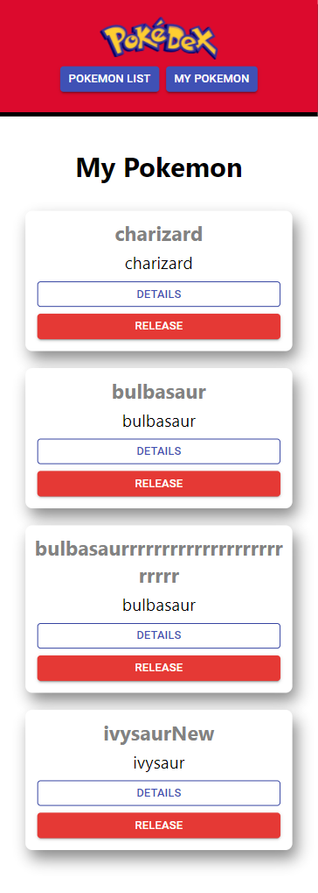
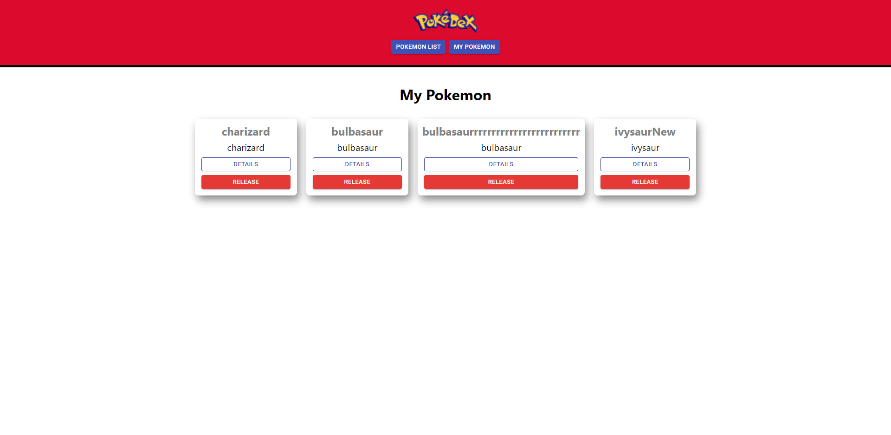

# Pokédex

Pokédex is a mobile-first & single page application (SPA) site made with React.

## Preparation

1. Git clone this repository using `git clone git@github.com:ferdysan360/pokedex.git` (SSH).

2. Go to the project root directory "~/pokedex" and run: `yarn add` in order to install all packages needed.

3. Wait for the installation to finish.

## How to Run the Site

You can go to the [github pages site](https://ferdysan360.github.io/pokedex), or if you want to run it on your localhost follow these steps:

1. Go to the project root directory "~/pokedex" and run: `yarn start`.

2. Go to your browser and go to `localhost:3000` in order to open the site.

## Additional Packages and Tools Used

1. Emotion (for CSS-in-JS).

2. Material UI (only for Dialog, Snackbar, and Button).

3. Loadable Component (for code-splitting).

4. Axios (for making HTTP requests).

5. Github-pages (for deploying to Github-Pages).

6. Lighthouse (for performance audit).

## Screenshots

### 1. Pokemon List Page

### 2. Pokemon Details Page

### 3. My Pokemon Page

